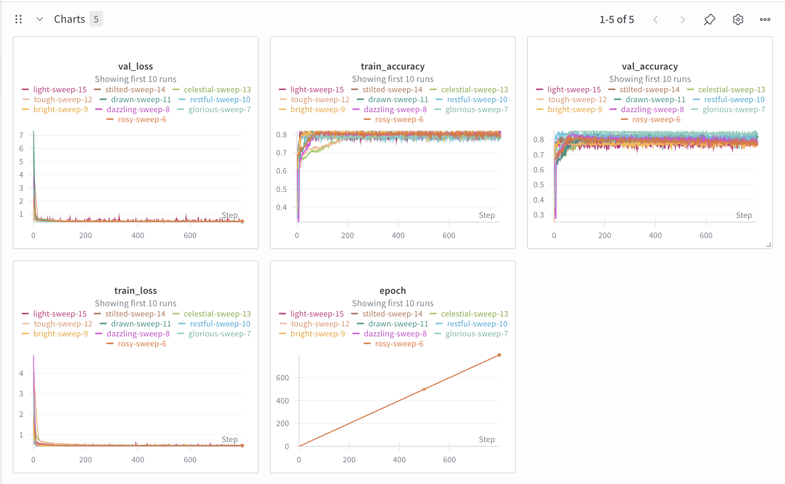
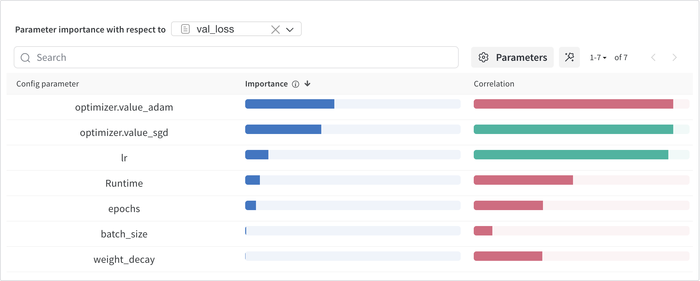
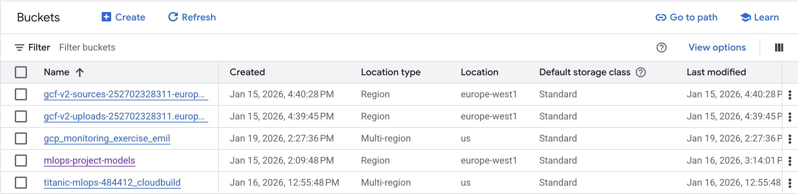
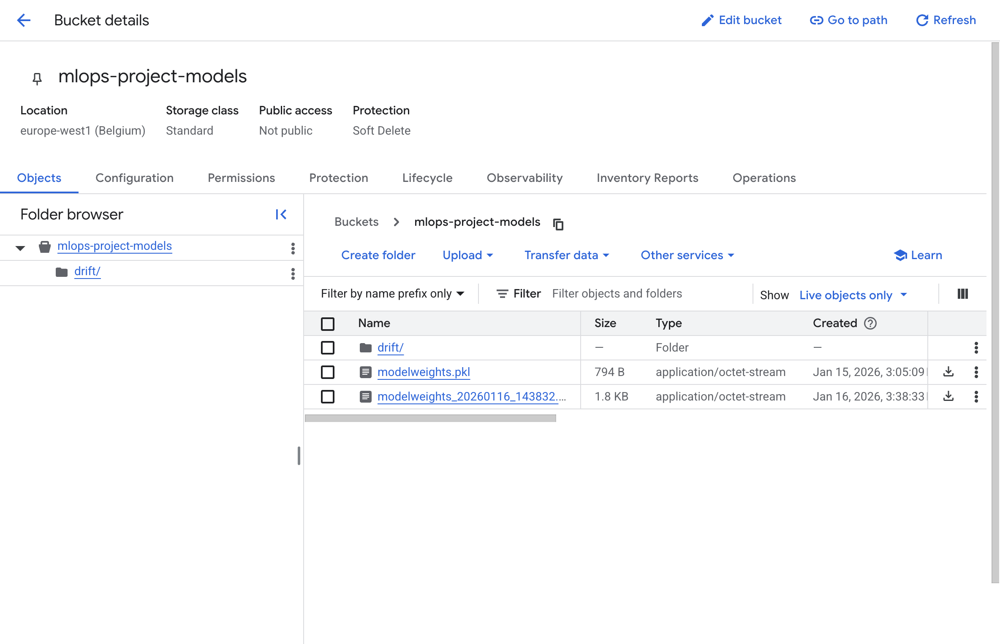
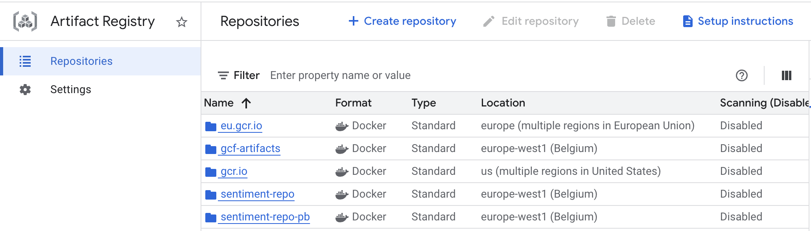
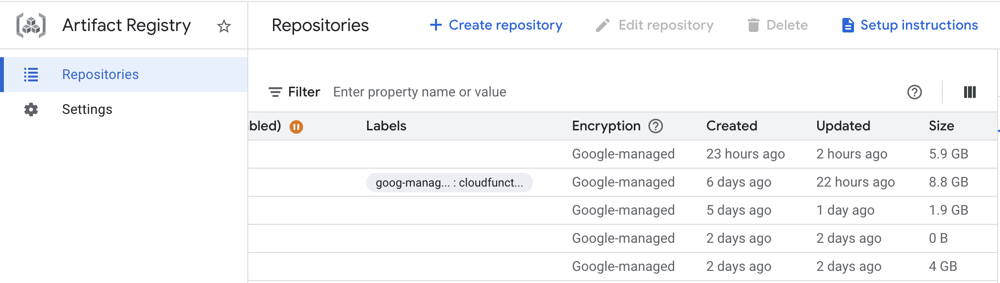
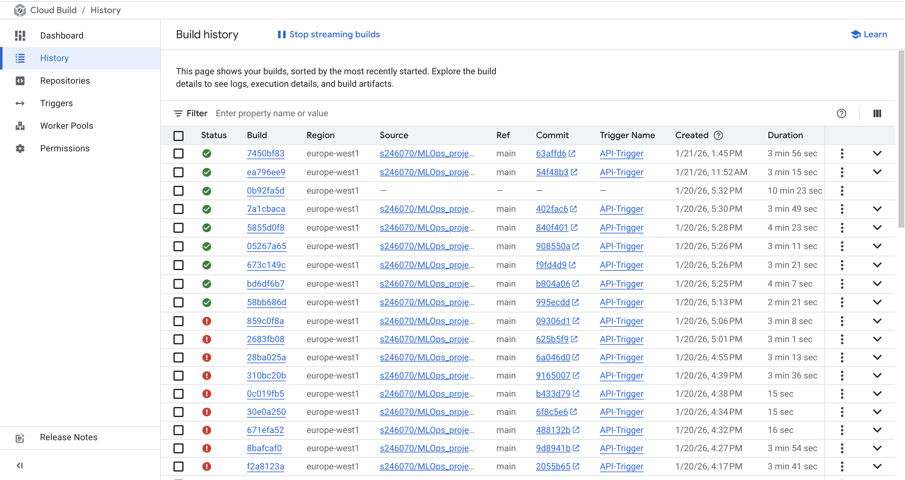
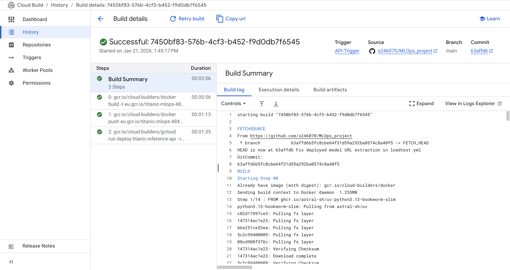
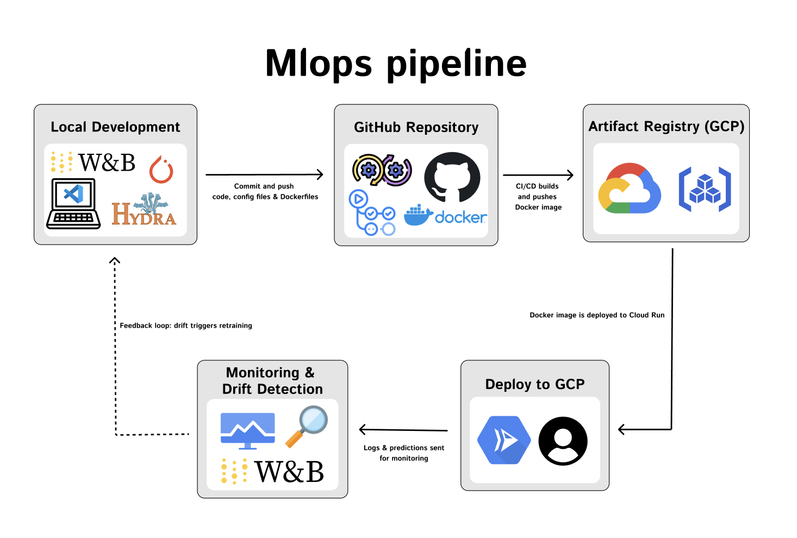

## Group information

### Question 1
> **Enter the group number you signed up on <learn.inside.dtu.dk>**
>
> Answer:

9

### Question 2
> **Enter the study number for each member in the group**
>
> Example:
>
> *sXXXXXX, sXXXXXX, sXXXXXX*
>
> Answer:

s246103, s246215, s246070, s245414, s240745

### Question 3
> **Did you end up using any open-source frameworks/packages not covered in the course during your project? If so**
> **which did you use and how did they help you complete the project?**
>
> Recommended answer length: 0-200 words.
>
> Example:
> *We used the third-party framework ... in our project. We used functionality ... and functionality ... from the*
> *package to do ... and ... in our project*.
>
> Answer:

We did not use any open-source packages outside the course-provided tools and libraries. All dependencies we relied on, including Function-Framework, scikit-learn, Hydra, Google Cloud SDK packages, Weights & Biases, and profiling or visualization tools like TensorBoard, SnakeViz, and memory-profiler, were part of the curriculum.
All dependencies are documented in our ` pyproject.toml `.

## Coding environment

> In the following section we are interested in learning more about you local development environment. This includes
> how you managed dependencies, the structure of your code and how you managed code quality.

### Question 4

> **Explain how you managed dependencies in your project? Explain the process a new team member would have to go**
> **through to get an exact copy of your environment.**
>
> Recommended answer length: 100-200 words
>
> Example:
> *We used ... for managing our dependencies. The list of dependencies was auto-generated using ... . To get a*
> *complete copy of our development environment, one would have to run the following commands*
>
> Answer:

We used ` uv` to manage all Python dependencies in our project. Instead of using ` requirements.txt`, we defined our dependencies in a ` pyproject.toml` file, grouped by core, dev, and optional packages. The exact versions were locked using a ` uv.lock` file, ensuring full reproducibility across environments.
To set up a complete and isolated development environment, a new team member would only need to:

` uv venv` - creates a virtual environment

` uv sync` - installs all locked dependencies

This setup is fast, deterministic, and avoids dependency conflicts. It ensures everyone on the team runs with exactly the same versions of all tools and libraries, including testing and documentation tools.

### Question 5

> **We expect that you initialized your project using the cookiecutter template. Explain the overall structure of your**
> **code. What did you fill out? Did you deviate from the template in some way?**
>
> Recommended answer length: 100-200 words
>
> Example:
> *From the cookiecutter template we have filled out the ... , ... and ... folder. We have removed the ... folder*
> *because we did not use any ... in our project. We have added an ... folder that contains ... for running our*
> *experiments.*
>
> Answer:

We initialized our project using the cookiecutter template. We followed the suggested structure closely but made a few practical adjustments.

We used the ` src/mlops_project` directory for all source code, including training logic, model loading, and evaluation. The HTTP-based API used for inference is implemented in a subfolder ` src/mlops_project/api/`. This separation made it easier to deploy the model independently from the training pipeline.

We did not use the ` docs/` or ` notebooks/` folders. Instead of ` requirements.txt`, we managed dependencies entirely through ` pyproject.toml` using the ` uv` dependency manager.

We added a ` wandb/` folder to store experiment tracking logs from Weights & Biases, and a ` profiling/` folder containing ` profile_training.py` to analyze training performance using tools like SnakeViz and memory-profiler. These folders were not part of the original template.

### Question 6

> **Did you implement any rules for code quality and format? What about typing and documentation? Additionally,**
> **explain with your own words why these concepts matters in larger projects.**
>
> Recommended answer length: 100-200 words.
>
> Example:
> *We used ... for linting and ... for formatting. We also used ... for typing and ... for documentation. These*
> *concepts are important in larger projects because ... . For example, typing ...*
>
> Answer:

We used ` ruff` for both linting and formatting, which was enforced via GitHub Actions in two workflows: ` ci.yml` and ` ruff_autocheck.yml`. The CI workflow automatically checks code style, formatting, and runs our tests on every push or pull request. The ` ruff_autocheck.yml` workflow runs ` ruff` in auto-fix mode on selected branches, committing fixes when possible.

We also used Python’s built-in type annotations to improve code readability and catch type-related issues early, though we did not enforce type checking with a separate tool.

Code style and formatting rules matter in larger projects because they reduce friction in collaboration, prevent merge conflicts, and make the codebase more maintainable. Linting helps catch bugs or bad practices before they become problems, and formatting ensures consistency regardless of who wrote the code.

## Version control

> In the following section we are interested in how version control was used in your project during development to
> corporate and increase the quality of your code.

### Question 7

> **How many tests did you implement and what are they testing in your code?**
>
> Recommended answer length: 50-100 words.
>
> Example:
> *In total we have implemented X tests. Primarily we are testing ... and ... as these the most critical parts of our*
> *application but also ... .*
>
> Answer:

In total, we implemented 7 unit and integration tests, along with a Locust-based load test. Our unit tests cover key components of the codebase, including the dataset loading, model architecture, and training logic. For instance, we test model initialization, output shapes, and error handling when input dimensions are incorrect.

We also implemented integration tests for the API, verifying both valid and invalid inference requests as well as the health check endpoint. Finally, our Locust load test simulates concurrent users hitting the prediction and health endpoints to measure API performance under load.

### Question 8

> **What is the total code coverage (in percentage) of your code? If your code had a code coverage of 100% (or close**
> **to), would you still trust it to be error free? Explain you reasoning.**
>
> Recommended answer length: 100-200 words.
>
> Example:
> *The total code coverage of code is X%, which includes all our source code. We are far from 100% coverage of our **
> *code and even if we were then...*
>
> Answer:

--- question 8 fill here ---

### Question 9

> **Did you workflow include using branches and pull requests? If yes, explain how. If not, explain how branches and**
> **pull request can help improve version control.**
>
> Recommended answer length: 100-200 words.
>
> Example:
> *We made use of both branches and PRs in our project. In our group, each member had an branch that they worked on in*
> *addition to the main branch. To merge code we ...*
>
> Answer:

We made use of both branches and pull requests (PRs) throughout our project. Each group member typically created a feature or fix branch when working on new functionality. This allowed us to develop and test code in isolation without directly affecting the ` main` branch.

When a task was completed, a pull request was opened to merge the branch into ` main`. These PRs had to be reviewed and approved by two team members, which helped catch bugs early, enforce consistent code style, and encourage collaboration through feedback.

Using branches and PRs improved our version control by making the development process safer and more transparent. It ensured that code was peer-reviewed before becoming part of the production-ready codebase, and gave us a clear history of changes and who made them.

### Question 10

> **Did you use DVC for managing data in your project? If yes, then how did it improve your project to have version**
> **control of your data. If no, explain a case where it would be beneficial to have version control of your data.**
>
> Recommended answer length: 100-200 words.
>
> Example:
> *We did make use of DVC in the following way: ... . In the end it helped us in ... for controlling ... part of our*
> *pipeline*
>
> Answer:

We did not use DVC in our project, but we implemented data version control using a different approach.
We created a Google Cloud Storage (GCS) bucket to store and version our trained models. In our application code, we used the ` google-cloud-storage` package to programmatically load the correct model version from the bucket using environment variables (` MODEL_BUCKET` and ` MODEL_BLOB`). This allowed us to separate model storage from the application logic and easily switch between model versions by changing the path to the model file in the bucket.
Although DVC provides more automation and tracking, our simpler setup was sufficient for our use case and gave us flexibility. In larger projects, however, DVC would be beneficial to formally track changes in data and models across experiments and ensure full reproducibility.

### Question 11

> **Discuss you continuous integration setup. What kind of continuous integration are you running (unittesting,**
> **linting, etc.)? Do you test multiple operating systems, Python  version etc. Do you make use of caching? Feel free**
> **to insert a link to one of your GitHub actions workflow.**
>
> Recommended answer length: 200-300 words.
>
> Example:
> *We have organized our continuous integration into 3 separate files: one for doing ..., one for running ... testing*
> *and one for running ... . In particular for our ..., we used ... .An example of a triggered workflow can be seen*
> *here: <weblink>*
>
> Answer:

We have organized our continuous integration into four separate GitHub Actions workflows. The main workflow, ` ci.yml`, runs on all pushes and pull requests. It handles unit testing using ` pytest`, code linting using ` ruff`, and formatting checks to ensure that all code contributions follow our quality standards. Additionally, we have an auto-fix workflow, ` ruff_autocheck.yml`, which runs on the main and tests branches. This workflow uses ` ruff` to automatically fix safe linting and formatting issues and commits them back to the repository if changes are made.

To validate that our deployed API is functioning correctly, we created a workflow file called ` test_api.yml`, which sends test requests to our live Cloud Run deployment and checks the responses. We also implemented ` loadtest.yml`, a workflow for load testing our API using Locust. This simulates multiple users interacting with the deployed API and uploads the performance results for inspection.

This continuous integration setup helped us maintain consistent code quality, identify bugs early, and verify that our API remained reliable and responsive after each deployment.

## Running code and tracking experiments

> In the following section we are interested in learning more about the experimental setup for running your code and
> especially the reproducibility of your experiments.

### Question 12

> **How did you configure experiments? Did you make use of config files? Explain with coding examples of how you would**
> **run a experiment.**
>
> Recommended answer length: 50-100 words.
>
> Example:
> *We used a simple argparser, that worked in the following way: Python  my_script.py --lr 1e-3 --batch_size 25*
>
> Answer:

We configured our experiments using Hydra configuration files. Our main ` config.yaml` file defines the overall setup, including model type, dataset paths, training hyperparameters, and logging. This base config can be overridden using experiment-specific files, such as ` exp1.yaml`, which sets a different random seed and custom WandB project name.

We stored hyperparameters in a separate ` hyperparameters/` folder, allowing for easy overrides when launching different experiments. For example, to run a specific experiment with our ` exp1.yaml`, we could run:

` python src/mlops_project/train.py --config-path experiments --config-name exp1.yaml `

We also used a ` sweep.yaml` file with Weights & Biases (WandB) to define Bayesian hyperparameter search. This allowed us to automatically run multiple configurations with different learning rates, optimizers, and batch sizes.

### Question 13

> **Reproducibility of experiments are important. Related to the last question, how did you secure that no information**
> **is lost when running experiments and that your experiments are reproducible?**
>
> Recommended answer length: 100-200 words.
>
> Example:
> *We made use of config files. Whenever an experiment is run the following happens: ... . To reproduce an experiment*
> *one would have to do ...*
>
> Answer:

We ensured reproducibility in multiple ways. First, we used configuration files managed by Hydra, so all hyperparameters and settings were stored in YAML format. This allows any experiment to be rerun by specifying the exact same config file, e.g., via ` --config-name exp1.yaml`.

To guarantee that no information is lost, all experiments were also logged to Weights & Biases (WandB). Each run logs the hyperparameters, training loss, and validation accuracy across epochs. The logs are automatically stored in the cloud and can be revisited later for comparison or reproduction.

Furthermore, we containerized both the training and preprocessing steps using Docker (` train.dockerfile` and ` data.dockerfile`). This ensures that dependencies and environments are consistent across machines and time.

Finally, each trained model was saved locally with a timestamp and uploaded to a Google Cloud Storage bucket. This versioned storage allows us to retrieve the exact model weights used in any experiment, reinforcing reproducibility across both code and data artifacts.

### Question 14

> **Upload 1 to 3 screenshots that show the experiments that you have done in W&B (or another experiment tracking**
> **service of your choice). This may include loss graphs, logged images, hyperparameter sweeps etc. You can take**
> **inspiration from [this figure](figures/wandb.png). Explain what metrics you are tracking and why they are**
> **important.**
>
> Recommended answer length: 200-300 words + 1 to 3 screenshots.
>
> Example:
> *As seen in the first image when have tracked ... and ... which both inform us about ... in our experiments.*
> *As seen in the second image we are also tracking ... and ...*
>
> Answer:

As seen in the first image, we are tracking key metrics such as ` train_loss`, ` val_loss`, ` train_accuracy`, and ` val_accuracy`. These metrics help us evaluate both how well the model fits the training data and how well it generalizes to unseen validation data. For example, while ` train_loss` indicates how well the model is optimizing on the training set, ` val_loss` is crucial to detect overfitting.

We also monitor ` train_accuracy` and ` val_accuracy` to get a more interpretable measure of performance, especially since we're working with binary classification. Accuracy complements the loss metrics by providing a direct measure of prediction correctness.

The second image shows a sweep of 10 runs with varying hyperparameters such as learning rate, optimizer type, batch size, weight decay, and number of epochs. The parameter importance plot gives insight into which hyperparameters most strongly influence model performance, in this case, ` optimizer` choice and ` learning rate` had the highest impact on validation loss.

### Question 15

> **Docker is an important tool for creating containerized applications. Explain how you used docker in your**
> **experiments/project? Include how you would run your docker images and include a link to one of your docker files.**
>
> Recommended answer length: 100-200 words.
>
> Example:
> *For our project we developed several images: one for training, inference and deployment. For example to run the*
> *training docker image: `docker run trainer:latest lr=1e-3 batch_size=64`. Link to docker file: <weblink>*
>
> Answer:

We created three separate Dockerfiles to support the key stages of our pipeline: data processing, model training, and deployment. The ` data.dockerfile` is used to preprocess the Titanic dataset before training with our data script (` data.py`), while the ` train.dockerfile` runs our training script (` train.py`) and logs the results to Weights & Biases. The ` api.dockerfile` is responsible for running our trained model as a containerized inference API using the Functions Framework, which mimics how we would deploy it on Google Cloud Functions. All Dockerfiles use the same slim base image (` ghcr.io/astral-sh/uv:python3.13-bookworm-slim`) and install dependencies using ` uv` and a ` pyproject.toml` with a locked ` uv.lock file`, ensuring reproducibility.

To run our API container locally for testing, we used ` docker build -f dockerfiles/api.dockerfile -t api .` followed by ` docker run -p 8080:8080 api`, which exposes the API on port 8080.

Link to our docker files: (https://github.com/s246070/MLOps_project/tree/main/dockerfiles)

### Question 16

> **When running into bugs while trying to run your experiments, how did you perform debugging? Additionally, did you**
> **try to profile your code or do you think it is already perfect?**
>
> Recommended answer length: 100-200 words.
>
> Example:
> *Debugging method was dependent on group member. Some just used ... and others used ... . We did a single profiling*
> *run of our main code at some point that showed ...*
>
> Answer:

Debugging methods varied across the group. Some members preferred traditional methods such as inserting ` print()` statements or using breakpoints in their IDE, while others experimented with the built-in Python debugger by adding ` import pdb; pdb.set_trace()` at specific points in the code. Although we briefly explored the use of the debugger as introduced in the exercises, not everyone actively used it in daily development.

In terms of profiling, we created a dedicated script called ` profile_training.py`, located in the ` profiling` folder. This allowed us to run the training code with ` cProfile` to identify any performance bottlenecks. While our model was relatively lightweight and the dataset small, the profiling helped confirm that there were no major inefficiencies in our data loading or training loop. Despite not running frequent profiling during development, this one-time check gave us confidence that our pipeline was reasonably optimized.

## Working in the cloud

> In the following section we would like to know more about your experience when developing in the cloud.

### Question 17

> **List all the GCP services that you made use of in your project and shortly explain what each service does?**
>
> Recommended answer length: 50-200 words.
>
> Example:
> *We used the following two services: Engine and Bucket. Engine is used for... and Bucket is used for...*
>
> Answer:

We used several services from Google Cloud Platform (GCP) to support our project infrastructure and deployment. First, we used Google Cloud Storage (GCS) to store trained models and enable cloud-based access for inference. Specifically, we saved our logistic regression models as ` .pkl` files using Python’s ` pickle` module, which allowed us to easily upload them to a GCS bucket and later load them into our deployed API.

Second, we set up a Service Account with appropriate permissions and authentication, which is used inside our Docker containers to enable secure access to GCP resources, such as the storage bucket, during training and inference.

Third, we deployed our inference logic using both Cloud Run and Cloud Functions. Cloud Run is used for container-based deployment, offering scalability and quick rollout of new Docker images. Cloud Functions handles the HTTP-based execution of our model inference (` logreg_classifier`) as a lightweight endpoint.

We implemented Cloud Monitoring and set up alerting rules to ensure operational stability. This allows us to be notified if the application experiences failures or performance degradation. Finally, we deployed a separate drift detection API to monitor changes in the distribution of incoming prediction data, which helps us detect when the model may need retraining.

### Question 18

> **The backbone of GCP is the Compute engine. Explained how you made use of this service and what type of VMs**
> **you used?**
>
> Recommended answer length: 100-200 words.
>
> Example:
> *We used the compute engine to run our ... . We used instances with the following hardware: ... and we started the*
> *using a custom container: ...*
>
> Answer:

We used Google Compute Engine to provide a VM in order to run experiments in a controlled and scalable environment. Following the exercises, we created an e2-medium instance (2 vCPUs and 4 GB RAM) located in the ` europe-west1-b` zone. This provided a cost-effective option that was sufficient for running our model training and evaluations.

We accessed the VM both through the web interface and via the terminal using ` gcloud compute ssh`. To simplify setup, we started the instance using a pre-configured PyTorch image from the ` deeplearning-platform-release project`. This meant that essential software such as Python, PyTorch, and CUDA drivers were already installed.

On the VM, we cloned our repository, pulled necessary data from our GCS bucket, and ran model training via ` uv run`. Running on Compute Engine ensured that we had a reproducible cloud environment, consistent with our local development setup, and it allowed us to better evaluate model performance in a production-like context.

### Question 19

> **Insert 1-2 images of your GCP bucket, such that we can see what data you have stored in it.**
> **You can take inspiration from [this figure](figures/bucket.png).**
>
> Answer:

Below are screenshots of our Google Cloud Storage (GCS) bucket showing the data stored for our project:

We primarily use the bucket named ` mlops-project-models` to store trained model artifacts and other relevant files. This ensures that our deployment pipeline can retrieve the latest model version when serving predictions through our API.

### Question 20

> **Upload 1-2 images of your GCP artifact registry, such that we can see the different docker images that you have**
> **stored. You can take inspiration from [this figure](figures/registry.png).**
>
> Answer:

We have created an Artifact Registry in Google Cloud Platform (GCP) to store our Docker images. This allows our Cloud Run services to pull container images directly from the registry and ensures proper versioning and management of our builds.

In the registry, we have stored Docker images for our ` titanic-inference-api`, which is used to serve predictions based on our trained Titanic model.

### Question 21

> **Upload 1-2 images of your GCP cloud build history, so we can see the history of the images that have been build in**
> **your project. You can take inspiration from [this figure](figures/build.png).**
>
> Answer:

We use Google Cloud Build to automatically build Docker images from our source code. Each time we push changes to our repository or trigger a new build manually, Cloud Build compiles our code, builds the Docker image, and pushes it to our Artifact Registry.

This ensures a reproducible and auditable pipeline. Our build history shows multiple successful builds, indicating a functioning CI/CD pipeline that integrates source code changes with image deployment.

### Question 22

> **Did you manage to train your model in the cloud using either the Engine or Vertex AI? If yes, explain how you did**
> **it. If not, describe why.**
>
> Recommended answer length: 100-200 words.
>
> Example:
> *We managed to train our model in the cloud using the Engine. We did this by ... . The reason we choose the Engine*
> *was because ...*
>
> Answer:

We initially tried to train the model with vertex AI, but could not make it work properly. So we ended up using the Engine instead, creating a virtual machine instance (titanic-engine). In the vm we started a docker container, which included all the necessary dependencies. The vm executed the training and automatically saved the model weights to a google cloud bucket. The Engine ended up working well for our purposes, allowing us to run out model training with little modification but still providing cloud compute resources. 

## Deployment

### Question 23

> **Did you manage to write an API for your model? If yes, explain how you did it and if you did anything special. If**
> **not, explain how you would do it.**
>
> Recommended answer length: 100-200 words.
>
> Example:
> *We did manage to write an API for our model. We used FastAPI to do this. We did this by ... . We also added ...*
> *to the API to make it more ...*
>
> Answer:

We did manage to write an API for our model. Unlike a typical FastAPI setup, we implemented a Google Cloud Function that wraps our logistic regression model. The API is defined in ` main.py`, and deployed using ` functions-framework` via a Docker container. It exposes an HTTP endpoint for predictions and supports both valid and invalid input handling, as well as a health check route.

The model weights are automatically downloaded from a Google Cloud Storage bucket on cold start. We also included input preprocessing logic directly in the API to ensure consistency with our training pipeline. Our API supports JSON requests, and we tested it using both unit tests and integration tests to verify inference behavior and response structure.

### Question 24

> **Did you manage to deploy your API, either in locally or cloud? If not, describe why. If yes, describe how and**
> **preferably how you invoke your deployed service?**
>
> Recommended answer length: 100-200 words.
>
> Example:
> *For deployment we wrapped our model into application using ... . We first tried locally serving the model, which*
> *worked. Afterwards we deployed it in the cloud, using ... . To invoke the service an user would call*
> *`curl -X POST -F "file=@file.json"<weburl>`*
>
> Answer:

We successfully deployed our model API using Google Cloud Functions. We containerized the API using a custom Dockerfile (` api.dockerfile`) and used the Functions Framework to expose the ` logreg_classifier` endpoint. Before deploying to the cloud, we verified that the API worked locally by using the ` run_local.py` script. In production, we uploaded the model weights to a GCS bucket and configured the API to load the model from there using environment variables and a service account.

To invoke the API, a user can make a POST request to the trigger URL provided by GCP. For example:

` curl -X POST https://REGION-PROJECT.cloudfunctions.net/logreg_classifier \`

` -H "Content-Type: application/json" \`

` -d '{"instances": [[1, "male", 3, 1, 22, 1, "S"]]}'`

This returns a JSON response with the predicted probability from our logistic regression model.

### Question 25

> **Did you perform any unit testing and load testing of your API? If yes, explain how you did it and what results for**
> **the load testing did you get. If not, explain how you would do it.**
>
> Recommended answer length: 100-200 words.
>
> Example:
> *For unit testing we used ... and for load testing we used ... . The results of the load testing showed that ...*
> *before the service crashed.*
>
> Answer:

We performed both unit testing and load testing on our API. For unit testing, we created a test file (` test_api.py`) under ` tests/integrationtests`, which verifies that the API responds correctly to a health check, a valid prediction request, and an invalid input. The purpose of these tests was to confirm that the API returns appropriate responses for both valid and invalid inputs, ensuring its stability across different scenarios.

To run the tests online with Cloud Run you use:

` API_URL=<api-service-url>`

` uv run pytest tests/integrationtests/test_api.py`

For load testing, we used Locust and created a ` locustfile.py` under ` tests/performancetests`. This simulates multiple concurrent users hitting the API endpoints, measuring response time and failure rate. The load test was run against our locally hosted API and helped us identify how the API performs under pressure.

### Question 26

> **Did you manage to implement monitoring of your deployed model? If yes, explain how it works. If not, explain how**
> **monitoring would help the longevity of your application.**
>
> Recommended answer length: 100-200 words.
>
> Example:
> *We did not manage to implement monitoring. We would like to have monitoring implemented such that over time we could*
> *measure ... and ... that would inform us about this ... behaviour of our application.*
>
> Answer:

We implemented a data drift monitoring as a production-oriented component. The deployed prediction service logs every inference request by storing the input feature vector, prediction and timestamp in GCS. To enable drift detection, we generated a reference dataset consisting of features only (target removed), using the same preprocessing steps as during model training. The reference dataset represents the baseline distribution the model was trained on. Furthermore, a drift-check API endpoint was implemented. This endpoint loads the reference dataset and the most recent production inputs from CS and computes data drift metrics to indicate whether the incoming data distribution has changed significantly compared to training. This extension was implemented to demonstrate how a deployed model can be monitored after deployment. This monitoring helps when data no longer matches the training distribution. By identifying such drift, the model can be retrained or updated before predictions become unreliable. Data drift is a common cause of performance degradation in production and adding automated drift detection improves robustness and makes the system more maintainable over time.

## Overall discussion of project

> In the following section we would like you to think about the general structure of your project.

### Question 27

> **How many credits did you end up using during the project and what service was most expensive? In general what do**
> **you think about working in the cloud?**
>
> Recommended answer length: 100-200 words.
>
> Example:
> *Group member 1 used ..., Group member 2 used ..., in total ... credits was spend during development. The service*
> *costing the most was ... due to ... . Working in the cloud was ...*
>
> Answer:

During the project, our team used a total of approximately $10.73 in credits. The most expensive service was Compute Engine, which accounted for $9.56 of the total usage. This was likely due to its use in model training or image building tasks during development.

Other services used included Cloud Build ($0.55), Artifact Registry ($0.17), and Cloud Run ($0.03). These costs reflect the pipeline steps required to build, store, and deploy Docker containers as part of our CI/CD setup.

Working in the cloud was mostly a positive experience. It allowed us to easily collaborate, deploy models at scale, and automate workflows without needing powerful local machines. The integration between services like Cloud Build, Cloud Run, and Artifact Registry was smooth and helped us understand better real-world MLOps practices.

### Question 28

> **Did you implement anything extra in your project that is not covered by other questions? Maybe you implemented**
> **a frontend for your API, use extra version control features, a drift detection service, a kubernetes cluster etc.**
> **If yes, explain what you did and why.**
>
> Recommended answer length: 0-200 words.
>
> Example:
> *We implemented a frontend for our API. We did this because we wanted to show the user ... . The frontend was*
> *implemented using ...*
>
> Answer:

We implemented a simple html frontend, to demonstrate the deployed model. The interface consists of an HTML form for collecting passenger features, a JavaScript fetch API for HTTP POST requests to the Cloud Function endpoint and a dynamic result rendering showing the survival prediction and confidence scores. Lastly we added some error handling for API connectivity issues.

### Question 29

> **Include a figure that describes the overall architecture of your system and what services that you make use of.**
> **You can take inspiration from [this figure](figures/overview.png). Additionally, in your own words, explain the**
> **overall steps in figure.**
>
> Recommended answer length: 200-400 words
>
> Example:
>
> *The starting point of the diagram is our local setup, where we integrated ... and ... and ... into our code.*
> *Whenever we commit code and push to GitHub, it auto triggers ... and ... . From there the diagram shows ...*
>
> Answer:

We start in the Local Development environment where we configure and train our model using PyTorch, manage hyperparameters with Hydra, and log training metrics and artifacts using Weights & Biases (W&B). Once the code and model configuration are ready, we commit and push everything to GitHub.

GitHub acts as the central code repository and also triggers GitHub Actions to run our CI/CD pipeline. This includes running unit tests, checking code style (linting), calculating code coverage, and building the Docker image.

The built image is pushed to Artifact Registry in Google Cloud, where we store and version our Docker containers. From here, the image is deployed to Cloud Run, providing an API endpoint for model inference.

The user can now access the deployed API through Cloud Run, which handles prediction requests. Meanwhile, logs, model predictions, and monitoring metrics are collected using W&B and GCP Monitoring tools.

This end-to-end system enables version-controlled, reproducible, and continuously tested ML pipelines — allowing us to easily monitor model performance and retrain when necessary.

The figure was manually created in Figma. Relevant logos were sourced from public Google Image searches.

### Question 30

> **Discuss the overall struggles of the project. Where did you spend most time and what did you do to overcome these**
> **challenges?**
>
> Recommended answer length: 200-400 words.
>
> Example:
> *The biggest challenges in the project was using ... tool to do ... . The reason for this was ...*
>
> Answer:

One of the most time-consuming and technically challenging parts of the project was training and deploying our model in Google Cloud using the Engine. Setting up the correct environment, configuring permissions, writing Dockerfiles, and ensuring the code ran correctly in the cloud required extensive debugging. We faced several issues related to authentication, service accounts, and specifying the correct entry points in our Docker containers before finally succeeding.

Another major struggle was setting up Continuous Integration (CI) using GitHub Actions. Integrating testing, linting, Docker builds, and caching across multiple environments introduced unexpected complexity. At times, the CI pipeline failed due to missing packages or inconsistent Python versions. To fix this, we modularized our CI workflows, added better error logging, and tested the pipeline iteratively until it worked reliably.

Another issue was that several group members had accidentally pushed conflicting versions of the ` pyproject.toml` and ` uv.lock` files. This caused package duplication, inconsistent Python versions across environments, and led to frustrating bugs, particularly with dependencies and import paths. To resolve this, we thoroughly cleaned up the files, standardized Python versions, and agreed on shared conventions for managing the environment going forward.

Finally, implementing data drift detection took considerable time. It involved logging predictions, monitoring input-output distributions, and preparing a pipeline that could retrigger model training based on certain thresholds. While not fully automated, we set up the core monitoring components and created a foundation for future improvements.

### Question 31

> **State the individual contributions of each team member. This is required information from DTU, because we need to**
> **make sure all members contributed actively to the project. Additionally, state if/how you have used generative AI**
> **tools in your project.**
>
> Recommended answer length: 50-300 words.
>
> Example:
> *Student sXXXXXX was in charge of developing of setting up the initial cookie cutter project and developing of the*
> *docker containers for training our applications.*
> *Student sXXXXXX was in charge of training our models in the cloud and deploying them afterwards.*
> *All members contributed to code by...*
> *We have used ChatGPT to help debug our code. Additionally, we used GitHub Copilot to help write some of our code.*
> Answer:

Student s246103 worked on integrating the model into the cloud using GCP services, including Docker containers and deployment pipelines.

Student s246215 focused on building core components of the training and inference pipeline, including model development, data handling, and logging with Weights & Biases.

Student s246070 helped set up the project structure, repository, and worked on monitoring and cloud infrastructure setup in GCP.

Student s245414 was responsible for designing configuration management using Hydra, profiling and helped build a frontend for the API.

Student s240745 handled CI/CD pipelines, data drifting/detection and contributed to code quality assurance, including setting up workflows, linters, and testing infrastructure.

All team members participated in debugging, testing, and iterating on the codebase, and contributed to documentation and final reporting. The work was divided collaboratively, and decisions were made jointly throughout development.

We used ChatGPT and Copilot to assist in debugging, refactoring, and documentation.s in the cloud and deploying them afterwards.
